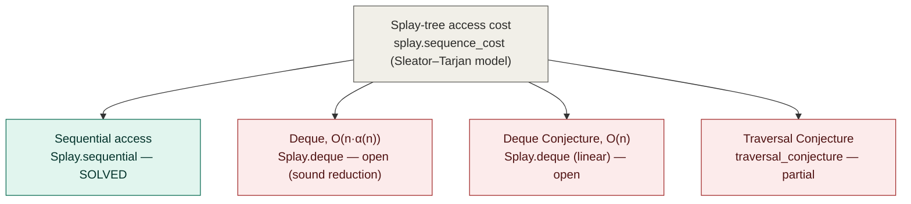
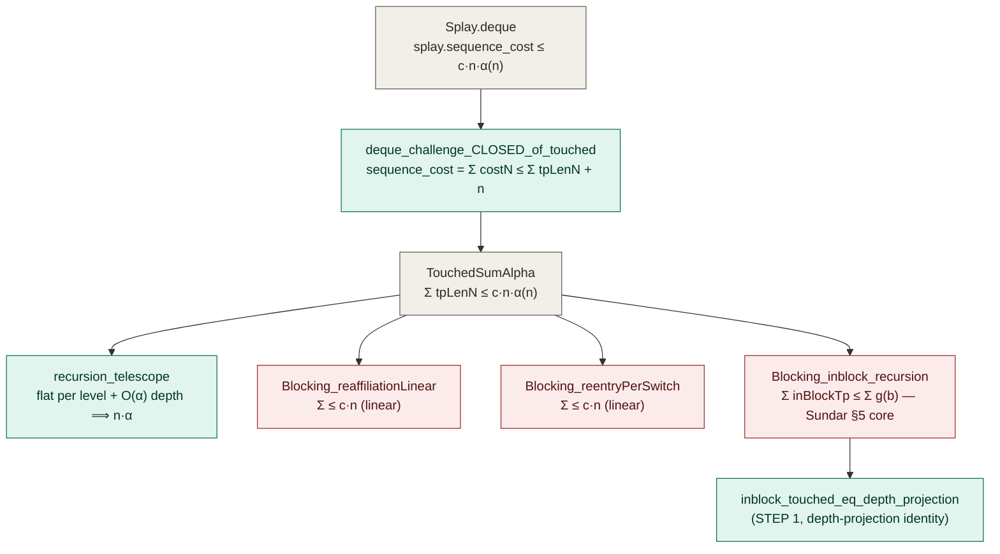
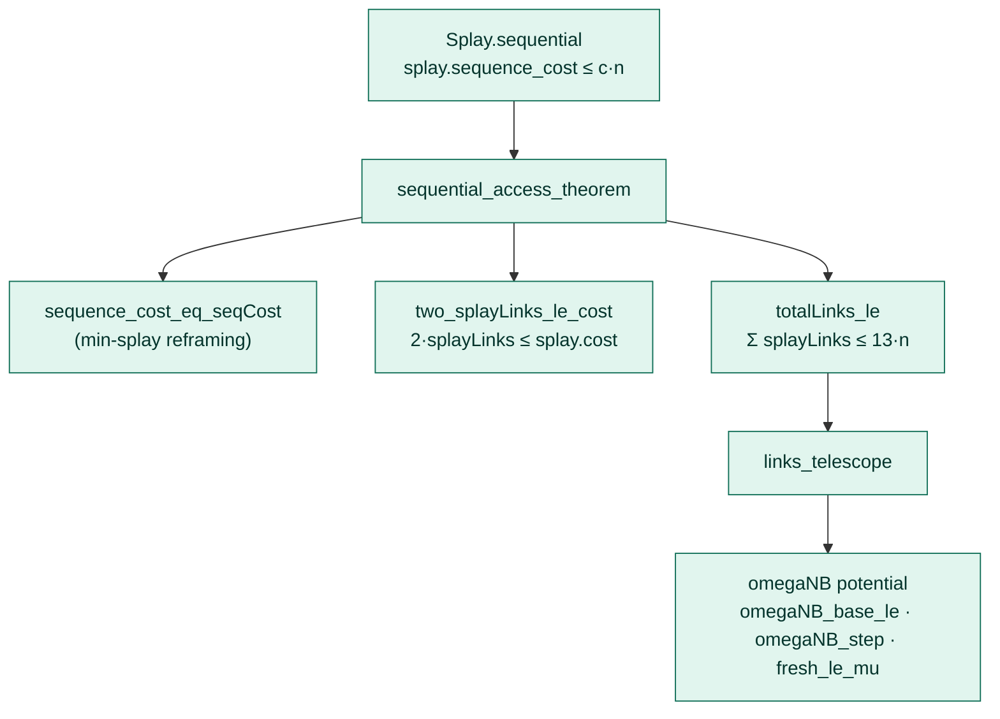

# Figures

Mermaid sources for the figures in the report (render on GitHub / arXiv-HTML;
convert to TikZ for the LaTeX submission). Node labels are the exact Lean
declaration names so each figure cross-references the formalization.

**Camera-ready asset.** A standalone, self-styled SVG of Figure 2 (light/dark
agnostic, embeddable directly in arXiv-HTML or convertible to PDF/TikZ) is at
`figure2_deque_reduction.svg`. It is the authoritative version of the Deque
reduction figure; the mermaid below is the editable source.

## Figure 1. Status of the four splay access problems

## Figure 2. The Deque O(n·α(n)) reduction: proven chain and the residual core

*Green: machine-checked, standard axioms. Red: open. The inverse-Ackermann factor
is confined to `Blocking_inblock_recursion`; the two linear residuals and the
entire chain `deque_challenge_CLOSED_of_touched ∘ recursion_telescope ∘
inblock_touched_eq_depth_projection` are discharged.*

## Figure 3. The Sequential Access Theorem (solved): proof dependency

*All nodes machine-checked (`Challenge_Splay_Sequential.lean`, standard axioms).*
